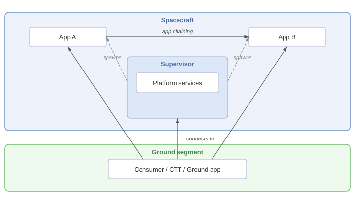

===========================
NMF Apps and the Supervisor
===========================

.. contents:: Table of contents
   :local:

The NMF runtime model is built around two composites that work together: the **Supervisor**, which
orchestrates the spacecraft-side runtime, and the **Connector**, which lives inside each NMF App and bridges
to the Supervisor.

NMF App
----------

An **NMF App** is a JVM process that exposes MO services and is managed by a Supervisor running on the same
spacecraft host. From the outside, an app is identified by its name and reached through its Directory Service
URI. Apps typically expose Monitor & Control services (parameters, actions, alerts) and may consume Platform
services from the Supervisor.

Apps are deployed as :doc:`packages` and started, stopped, and observed through the SM ``AppsLauncher``
service. See :doc:`mo-architecture` for the service stack and :doc:`lifecycle` for the operational view.

Supervisor
----------

The **Supervisor** (``NanoSatMOSupervisor``) is the process that owns the spacecraft-side of the NMF runtime.
Its responsibilities include:

- Hosting the **Software Management** services — ``AppsLauncher``, ``PackageManagement``, ``Heartbeat``,
  ``CommandExecutor`` — through which apps are managed and the spacecraft is operated.
- Hosting the **Platform** services that expose the spacecraft's hardware (camera, GPS, ADCS, power, etc.) to
  apps.
- Hosting a **Directory Service** that all apps register against, so that consumers and other apps can
  discover them.
- Spawning and supervising app processes started through the ``AppsLauncher`` service.

A single Supervisor runs per spacecraft host. It is normally started at boot and remains up for the duration
of the mission.

The Connector
-------------

Inside each app, the **Connector** (``NanoSatMOConnectorImpl``) is the gateway to the Supervisor. It performs
three jobs:

- **Registers the app** with the Supervisor's Directory Service so it becomes discoverable.
- **Provides consumer stubs** for the Supervisor's Platform and SM services, accessed via ``NMFInterface``
  methods such as ``getPlatformServices()``, so the app can read GPS, command the camera, and so on.
- **Routes the app's M&C services** (Parameter, Action, Alert, Aggregation, Conversion) for consumption by
  ground software or by other apps.

The Connector is the only NMF dependency the app's main class needs to know about; everything else is reached
through it.

Communication paths
-------------------

Four communication patterns appear repeatedly in NMF deployments:

- **Consumer → Supervisor.** A ground operator (CTT, EUD4MO, custom ground software) connects to the
  Supervisor's Directory Service, discovers running apps, and invokes operations on the Supervisor's SM and
  Platform services.
- **Consumer → App.** Once an app is discovered through the Directory Service, the consumer connects directly
  to the app's MC services to read parameters, invoke actions, or subscribe to alerts.
- **App → Supervisor.** Apps consume the Supervisor's Platform services through their Connector — for example,
  reading GPS position before scheduling an observation.
- **App → App** (*app chaining*). One app's output can drive another app's behaviour. The ɸ-Sat-2 mission
  demonstrated this with two-stage image processing: a first app classified image tiles as cloudy or clear; a
  second app processed only the clear ones.

For ground deployments where the consumer is on a network separate from the space link, a **GroundMOProxy**
bridges the two. See the Specific Missions section for mission-specific topologies.
