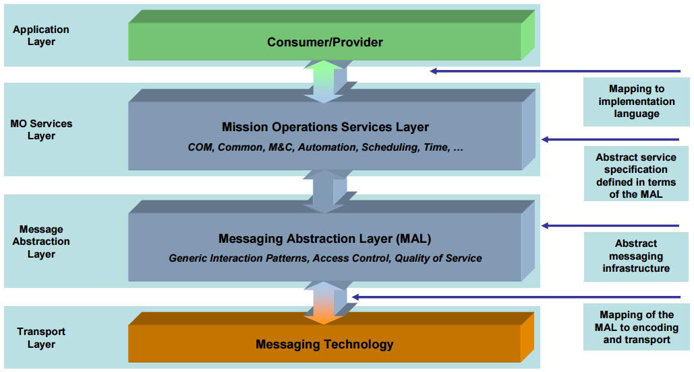

========================
MO Services Architecture
========================

.. contents:: Table of contents
   :local:

The NMF is built on the **CCSDS Mission Operations (MO) services**, a layered set of standards that define how
mission operations are conducted between a spacecraft and its ground segment. This section describes the
layers and the services that the NMF exposes within each.

The MAL Foundation
------------------

The **Message Abstraction Layer (MAL)** is the foundational layer. It defines:

- A language- and transport-independent **interaction model** (Send, Submit, Request, Invoke, Progress,
  PubSub).
- A set of **MAL data types** (primitives, composites, enumerations) used by every service.
- Bindings to concrete transports (e.g. ``maltcp``) and encodings (e.g. binary, XML).

Service operations are described in **MO XML** under ``core/mo-services-xml/``; the Java API JARs in
``core/mo-services-apis/`` are generated from these specifications.

Service Areas
-------------

Multiple service areas are defined on top of MAL.

Common Object Model (COM)
^^^^^^^^^^^^^^^^^^^^^^^^^

The **Common Object Model (COM)** sits on top of MAL and provides the infrastructure services used by every
higher-level service:

- **Event** — generation and distribution of asynchronous events.
- **Archive** — persistent storage of COM objects, queryable by domain, type, time range, and source.
- **ArchiveSync** — synchronisation of a COM Archive with a remote provider.
- **Directory** — discovery of services by domain and provider.
- **Login** — authentication of consumers.
- **Configuration** — persistence and restoration of provider configurations.

Every higher-level service stores its definitions and instances as COM objects in the Archive, enabling
uniform persistence and queries across all services.

Monitor & Control (MC)
^^^^^^^^^^^^^^^^^^^^^^

Services for exposing telemetry and accepting commands:

- **Parameter** — definition, generation, retrieval, and subscription of telemetry parameters.
- **Action** — invocation and progress reporting of commands.
- **Aggregation** — grouping of parameters into reports.
- **Alert** — generation and distribution of operational alerts.
- **Conversion** — declarative conversions between raw and engineering parameter values.

Software Management (SM)
^^^^^^^^^^^^^^^^^^^^^^^^

Services for managing the apps running on the spacecraft, all exposed by the Supervisor:

- **AppsLauncher** — run, stop, kill, list, and monitor the output of apps.
- **PackageManagement** — install, uninstall, upgrade, and check NMF Packages.
- **Heartbeat** — periodic liveness signal published by a provider.
- **CommandExecutor** — execute arbitrary shell commands on the spacecraft host (where permitted by mission
  policy).

Platform
^^^^^^^^

Services exposing spacecraft platform hardware to apps:

- **Camera** — acquire pictures from and control a camera; supports format conversion and periodic streaming.
- **GPS** — retrieve satellite navigation data from a GNSS receiver; stream NMEA messages, query the last
  known position, and track nearby position events.
- **AutonomousADCS** — monitor spacecraft attitude and engage or disengage attitude control modes.
- **SoftwareDefinedRadio** — configure and receive data from a Software-Defined Radio device.
- **OpticalDataReceiver** — receive messages from an Optical Data Receiver device.
- **PowerControl** — list available power units and enable or disable them.
- **ArtificialIntelligence** — control an AI device, including setting models and running image inference.
- **FPGA** — load and unload gateware modules into the reconfigurable partitions of the platform FPGA.
- **SoftwareImages** — start, stop and restart software images in the partitions of the platform hypervisor.

Apps consume these services through the Supervisor; see :doc:`apps-and-supervisor`.

Where to find authoritative definitions
---------------------------------------

The MO XML files in ``core/mo-services-xml/`` are the source of truth for all service definitions. For
per-service implementation details, see the Reference section. Formal specification PDFs are listed under the
Background & Reference Documents section but are no longer actively maintained.
