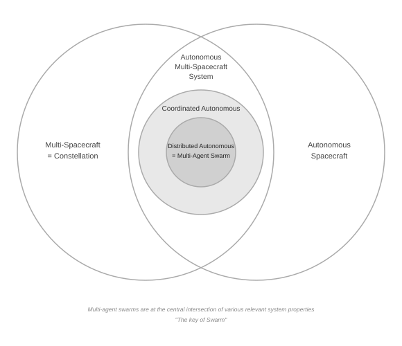

=======
App ISL
=======

.. contents:: Table of contents
   :local:

**Inter-Satellite Link (ISL)** is a communication link between satellites or spacecraft that enables them to
exchange data directly without relying on ground stations. ISLs support coordination, distributed
decision-making, navigation, synchronisation, and data relaying within satellite constellations or spacecraft
swarms.

The NanoSat MO Framework architecture supports ISL and its capabilities are expected to be enhanced in the
medium-term.

Overview
--------

App ISL — sometimes called *formation flying apps* in earlier NMF literature — extends the :doc:`app-chaining`
pattern across spacecraft boundaries. Where App Chaining lets apps on the **same** spacecraft consume each
other's MO services through the local Supervisor's Directory Service, App ISL does the same between apps
running on **different** satellites in a multi-satellite mission.

The growing prevalence of swarm missions (from LEO constellations already flying autonomously today, to
planned HEO formation pairs, GEO science swarms, and beyond-Earth CubeSat clusters) makes cross-satellite
service composability increasingly important. App ISL is the NMF answer: rather than building bespoke
inter-satellite protocols into each mission, apps communicate through the same MO service interfaces they
already use on-board, mediated by an ISL-capable MAL transport.

The pattern works because the NMF is built on service-oriented principles: an app does not care whether the
peer it connects to is local or remote. The Directory Service handles discovery and once a peer's URI is
reachable, the full set of services from the app is available without any ISL-specific code in the app.

Formation types
---------------

The three formation types encountered in multi-satellite missions map naturally onto App ISL:

**Constellation formations**
  Many instances of the same app are deployed across multiple satellites, each operating independently but
  sharing the same software. Apps can cross-subscribe to each other's parameter streams for fleet-wide
  monitoring and distributed data aggregation without any change to the app code.

**Cluster formations**
  Satellites in close proximity require tight coordination. A concrete example is ESA's Asteroid Impact
  Monitoring (AIM) mission concept, in which a set of nanosatellites would fly around the impact zone created
  by the DART spacecraft and collect data collaboratively. By deploying interlinked apps across the cluster
  nodes — each consuming the others' services through the Directory Service — coordination logic can be
  expressed as modular apps rather than hardwired mission software, and individual nodes can be added or
  replaced without modifying their peers.

**Trailing formations**
  One spacecraft follows another along the same ground track. The trailing satellite can subscribe to the
  leading satellite's sensor output or classification results and condition its own payload operations on them
  — the same pipeline as :doc:`app-chaining`, extended over the cross-link.

Swarm missions
--------------

**What is a Swarm?**

- **Multi-Spacecraft/Constellation system** — A system composed of multiple spacecraft.
- **Autonomous system** — Able to make complex, important decisions independently from external control.
- **Coordinated system** — As opposed to a constellation of independently operating agents that solve fully
  decomposable system-level problems without interacting.
- **Distributed system** — A system that operates without centralised control.
- **Multi-Agent Swarm** — The intersection of all the previous definitions.

         of Multi-Spacecraft/Constellation and Autonomous Spacecraft systems,
         further constrained by Coordinated Autonomous and Distributed
         Autonomous properties.

Swarm missions add **autonomous reconfiguration** and **distributed control** to the formation flying picture:
they act as a multi-agent system, adapting its behaviour without ground intervention. App ISL provides the
inter-node service fabric that makes this possible within the NMF model.

A swarm app running on each node can:

- Publish its local sensor readings and state as MO parameters.
- Subscribe to peer nodes' parameters over the ISL to build a shared situational picture.
- Invoke actions on peer nodes to coordinate manoeuvres or payload scheduling.
- Use the on-board :doc:`platform-services/artificial-intelligence` service to run local inference, then share
  results across the swarm rather than downlinking raw data.

Because each node is a standard NMF Supervisor with the same Directory Service mechanism, the swarm topology
is discovered at runtime rather than hardwired at compile time. Nodes can join or leave the swarm and the
remaining peers adapt through re-discovery.

How it fits in the NMF architecture
-------------------------------------

The NMF MO stack is transport-agnostic. Each spacecraft runs a Supervisor containing a Directory Service
acting as the local registry of available Apps and their respective services. App Chaining works today because
both apps share the same ``maltcp://`` network segment and resolve each other's URIs locally.

App ISL extends this by making a **remote** satellite's Directory Service reachable over an ISL-capable MAL
transport. Once that transport binding is registered, the same ``SpaceMOAdapterImpl`` factory method used for
App Chaining works unchanged — only the Directory Service URI points to the remote satellite:

.. code-block:: java

   // Intra-spacecraft (existing, works today)
   SpaceMOAdapterImpl peerSMA = SpaceMOAdapterImpl.forNMFApp(
           connector.readCentralDirectoryServiceURI(),
           "cloud-classifier");

   // Inter-satellite (App ISL — requires ISL-capable transport)
   URI remoteDirectoryURI = URI.create("maltcp://192.168.100.2:1024/nanosat-mo-supervisor-Directory");
   SpaceMOAdapterImpl remoteSMA = SpaceMOAdapterImpl.forNMFApp(
           remoteDirectoryURI,
           "cloud-classifier");

The remote ``SpaceMOAdapterImpl`` exposes the peer app's MC services exactly as if they were local.

Transport requirements
----------------------

ISL transport bindings must handle the characteristics of satellite cross-links:

- **Intermittent connectivity** — the link is only open during contact windows. MAL bindings should buffer
  outgoing messages and deliver them when the link is available.
- **High latency** — round-trip delays range from milliseconds (LEO formation) to seconds (deep-space relay).
  Subscribe-based interaction patterns (``monitorValue``) should be preferred over synchronous polling.
- **Low bandwidth** — compact binary MAL encodings should be selected over verbose text-based alternatives to
  make efficient use of the limited cross-link capacity.

The NMF roadmap covers two implementation paths:

1. **A dedicated ISL Platform service** — a new Platform service that manages link scheduling,
   store-and-forward queuing, and link-state reporting, surfaced to apps as a typed MO service.
2. **Deeper transport-layer integration** — extending existing MAL transport bindings to transparently bridge
   the cross-satellite hop, so apps need no awareness of the underlying link.

Until a production ISL transport is available, the pattern can be prototyped using a ``GroundMOProxy`` to
relay MAL messages between two simulator instances connected over an ordinary TCP network. The
containerisation of the NMF will also help in testing and prototyping.

Relationship to App Chaining
------------------------------

App ISL is a direct extension of :doc:`app-chaining` (historically called *cascading apps*) to the
cross-satellite case:

.. list-table::
   :header-rows: 1
   :widths: 30 35 35

   * - Dimension
     - App Chaining
     - App ISL
   * - Scope
     - Single spacecraft
     - Multi-satellite formation or swarm
   * - Directory Service
     - Local Supervisor
     - Remote Supervisor over ISL transport
   * - Transport
     - Any local MAL binding (e.g. ``maltcp://``)
     - ISL-capable MAL binding required
   * - App code changes
     - None (uses ``forNMFApp``)
     - None (uses ``forNMFApp`` with remote URI)
   * - Availability
     - Current release
     - Roadmap

Roadmap status
--------------

Full ISL service support is tracked in the NMF roadmap (see ``ROADMAP.md`` in the repository root).
Contributions and proposals for the transport binding design are welcome on the project issue tracker.
