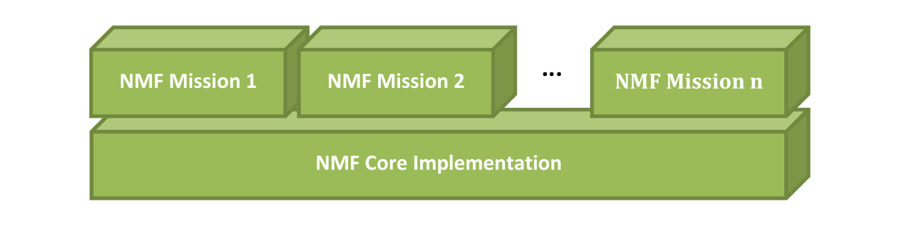

================================
Development Guide for Missions
================================

An **NMF Mission** is a concrete implementation of the NanoSat MO
Framework for a specific mission. It leverages the existing NMF Core
implementation: the core provides the reusable software; the
mission wraps the spacecraft's hardware into NMF-compatible services.

.. note::

   Mission development is separate from App development and Ground
   software development. The same NMF Core can be reused by any number
   of independent missions, and a correctly written NMF App is
   mission-agnostic. The NMF App runs unmodified on any mission that
   provides the platform services it needs.

How to develop an NMF Mission?
------------------------------

An NMF Mission is composed of the following parts:

1. **A concrete** ``NanoSatMOSupervisor`` **subclass** — the process
   that boots on the spacecraft. It is responsible for starting the
   NMF Apps and supervises them. Also, it exposes the Platform
   services to both the NMF Apps and to Ground.

2. **Platform service adapters** — hardware-specific implementations
   of the Platform service adapter interfaces (GPS, ADCS, Camera, …).
   These are the only code in the system that talks to real hardware;
   everything above them speaks MO services.

3. **A custom transport binding** (if required) — if a custom or
   tailored transport is used for the mission, the transport binding
   must be implemented and integrated with the Ground MO Proxy for
   protocol bridging.

The on-board filesystem layout — the directory tree and startup
scripts that the Supervisor and Apps expect to find on the spacecraft's
file system — is generated automatically by the
``nmf-linux-maven-plugin`` (see :doc:`filesystem`).

.. toctree::
   :maxdepth: 1
   :caption: Contents

   supervisor
   platform-services
   filesystem
   app-isolation
   deployment
