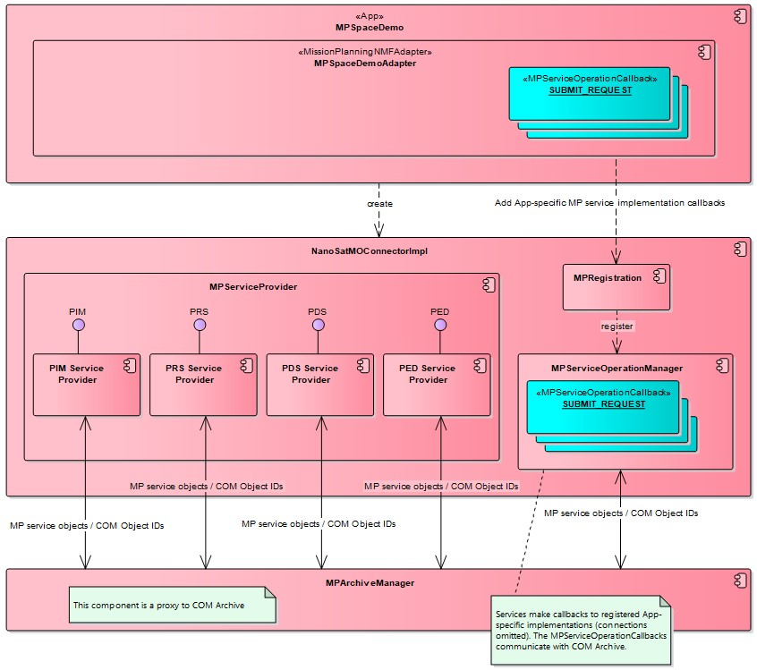

===========================
MP Services App development
===========================

.. contents:: Table of contents
    :local:

MPSpaceDemo is a good starting point. Follow to MPSpaceDemoAdapter.

Overview
---------
The services have default implementations and App-specific over-rides. For example, PlanningRequestProviderServiceImpl is the default implementation for Planning Request service. The default implementation makes callbacks that are implemented by Apps.

A typical MP service operation makes a callback to validate the input data. If successful then the default operation implementation stores the input data to COM Archive, and makes a callback to App, which may then choose to implement any specific behaviour.

COM Archive is a central component in MP service implementations. For example, submitRequest (in PlanningRequestProviderServiceImpl) makes a callback to validate the incoming Request. The operation then stores the Request to COM Archive. Finally, there is a callback for App-specific implementation. The Request is passed to callback using ID, since it is already stored in COM Archive. The App may retrieve the Request from COM Archive, create new COM Objects, activate a Planner, etc.

Components
----------
An important class for App developers is MPSpaceDemoAdapter (a sample application). It registers callbacks using MPServicOperation enumerations.

In MPServiceCallback there are validation callbacks for each MP entity (Request, Event, Activity, etc) and a general onCallback(). The latter takes as argument the service object IDs, which are encapsulated by MPServiceOperationArguments.

The App developer is expected to look up the types of arguments used in the default implementation. For example, submitRequest operation uses identityId and instanceId, to reference the RequestIdentity and RequestVersionDetails.

