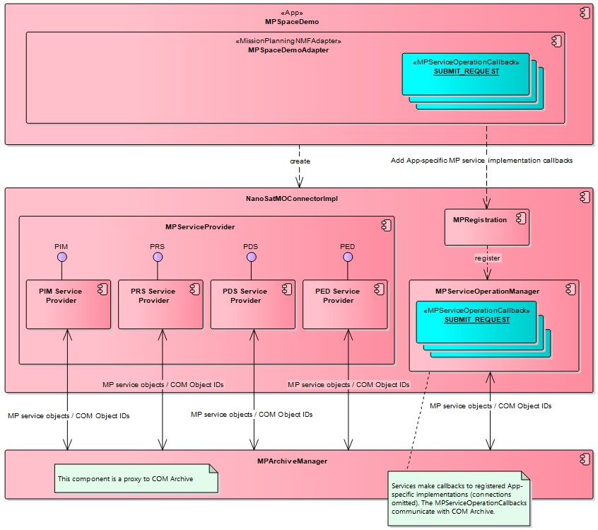

===========================
MP Services App development
===========================

.. contents:: Table of contents
    :local:

The ``MPSpaceDemo`` application, together with its ``MPSpaceDemoAdapter``, provides a recommended starting point for developing apps that expose MP services.

Overview
--------
The MP services have default implementations that can be extended via app-specific overrides. For example, ``PlanningRequestProviderServiceImpl`` is the default implementation of the Planning Request service. The default implementation invokes callbacks that are implemented by the app.

A typical MP service operation first invokes a validation callback for the input data. If validation succeeds, the default implementation stores the input data in the COM Archive and then invokes an app-specific callback, allowing custom behaviour to be applied.

The COM Archive is a central component in MP service implementations. For example, ``submitRequest`` (in ``PlanningRequestProviderServiceImpl``) invokes a validation callback for the incoming request, stores the request in the COM Archive, and finally invokes an app-specific callback. Because the request is already stored, only its identifier is passed to the callback; the app may then retrieve the request from the COM Archive, create new COM objects, activate a planner, and so on.

Components
----------
``MPSpaceDemoAdapter`` is an important reference for app developers. The sample application registers callbacks using the ``MPServiceOperation`` enumeration.

``MPServiceCallback`` declares validation callbacks for each MP entity (Request, Event, Activity, etc.) as well as a general ``onCallback()`` method. The latter accepts service object identifiers encapsulated in ``MPServiceOperationArguments``.

App developers are expected to consult the default implementation to determine the argument types used by each operation. For example, the ``submitRequest`` operation uses ``identityId`` and ``instanceId`` to reference the ``RequestIdentity`` and ``RequestVersionDetails`` objects.

